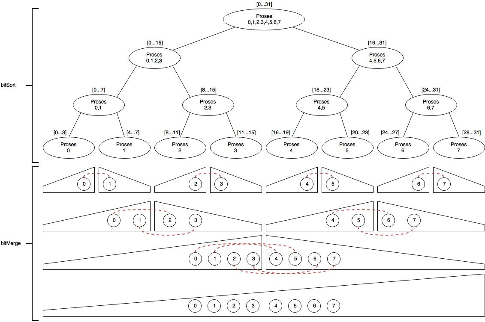

# Bitonic Sort

Tugas OpenMPI - Bitonic Sort. Praktikum2_K01_13515097

## Petunjuk penggunaan program

1. Buka terminal, jalankan make
```
$ make
  ```
2. Untuk menjalankan program, jalankan
```
$ mpirun -np <p> ./bitonic_sort <n>
```
    - p : banyaknya proses yang digunakan
    - n : problem size / banyaknya elemen random

## Pembagian tugas

| NIM | Nama | Tugas |
| ------ | ------ | ------ |
| 13515097 | Dery Rahman A | All |

## Laporan

### Deskripsi solusi paralel
Bitonic sort merupakan salah satu teknik sorting network yang dapat diparalelkan, dengan kompleksitas O(log<sup>2</sup>n). Konsep bitonic sort sendiri yaitu dengan membuat bitonic subsequence pada tiap iterasinya. Sequence ``0..n`` dikatakan **bitonic increasing** jika terdapat subsequence ``0..a`` menaik, dan ``a..n`` menurun, dan dikatakan **bitonic decreasing** jika terdapat subsequence ``0..a`` menurun, dan ``a..n`` menaik ``(0<=a<=n)``.

Untuk paralelisasi bitonic sort pada MPI, dapat dilakukan dengan membagi `n` problem kedalam `p` proses. Proses pembagian ini dilakukan secara rekursif, dengan membagi `p` proses menjadi 2, kemudian dibagi lagi menjadi 2, hingga akhirnya terdapat 1 proses.

Kemudian masing-masing proses `(i=0,1,2,..p-1)` tersebut akan memproses sequence index ke `i*n/p` hingga `(i+1)*n/p` secara serial. Proses genap `(0,2,4,...)` akan membuat sequence menaik, sedangkan proses ganjil `(1,3,...)` akan membuat sequence menurun.

```
void bitSort(int* arr, int lo, int n, int dir, int n_proc){
  if(n_proc>1){
    bitSort(arr, lo, m, 1, n_proc>>1);
    bitSort(arr, lo+m, m, 0, n_proc>>1);
    bitMerge(arr, lo, n, dir);
  } else {
    bitSortSer(arr,lo,n,dir); // sort secara serial
  }
}
```

Kemudian ketika merge dilakukan, hasil sequence yang telah diurutkan menaik / menurun pada tiap proses, akan ditransfer ke proses tetangganya dengan cara melakukan message passing. Merge akan dilakukan kedua proses tersebut, dimana sequence akhir yang telah dimerge tersebut akan terurut menaik / menurun.

<div style="text-align:center"></div>

<p style="text-align: center;">Ilustrasi 1.1</p>

Dari ilustrasi terlihat bahwa setiap proses hanya bertugas untuk melakukan merge terhadap proses tetangganya. Hal ini dapat mengurangi beban yang dilakukan jika hanya menggunakan 1 proses saja. Setiap proses hanya bertanggung jawab terhadap subsequence yang diassign kepadanya.

### Analisis solusi
Solusi yang digunakan yaitu memparalelkan pada fungsi rekursif bitonic sort. Setiap proses yang telah mendapat subsequence dari proses tetangganya (proses merge) dapat melakukan sorting bitonic dalam waktu yang bersamaan. Sehingga hal ini dapat mempersingkat waktu setiap step rekursifnya.

```
void bitSort(int* arr, int lo, int n, int dir, int n_proc){
  int m = n/2;
  int my_rank;
  int comm_sz;
  MPI_Comm_rank(MPI_COMM_WORLD, &my_rank);
  MPI_Comm_size(MPI_COMM_WORLD, &comm_sz);
  if(n_proc>1){
    int gap = n_proc>>1;
    if((my_rank%n_proc)<(n_proc>>1)){
      bitSort(arr, lo, m, 1, n_proc>>1);
      // mengirim subsequence ke proses tetangganya
      int neighbour_proc = (my_rank+gap)%comm_sz;
      MPI_Send(arr+lo, m, MPI_INT, neighbour_proc, gap, MPI_COMM_WORLD);
      MPI_Recv(arr+lo+m, m, MPI_INT, neighbour_proc, gap, MPI_COMM_WORLD, MPI_STATUS_IGNORE);
      bitMerge(arr, lo, n, dir);
    } else {
      bitSort(arr, lo+m, m, 0, n_proc>>1);
      // mengirim subsequence ke proses tetangganya
      int neighbour_proc = (my_rank-gap+comm_sz)%comm_sz;
      MPI_Recv(arr+lo, m, MPI_INT, neighbour_proc, gap, MPI_COMM_WORLD, MPI_STATUS_IGNORE);
      MPI_Send(arr+lo+m, m, MPI_INT, neighbour_proc, gap, MPI_COMM_WORLD);
      bitMerge(arr, lo, n, dir);
    }
  } else {
    bitSortSer(arr,lo,n,dir);  // sort secara serial
  }
}
```

Dari hasil percobaan yang dilakukan dengan menggunakan 64 core, dengan proses sebanyak `4` atau `8` buah, didapatkan speedup yang mencapai ~1-4x lipat.

**Solusi kinerja yang lebih baik**

Untuk mendapatkan kinerja yang lebih baik, sorting serial yang dilakukan pertama kali pada setiap proses, dapat dilakukan dengan bitonic sort paralel dengan pthread, atau openMP.

Atau bisa juga dengan mengurangi overhead ketika melakukan *message passing* / mengefisiensikan IO.

### Jumlah proses
Saya menggunakan jumlah proses sebanyak 4 atau 8 buah. Hal ini didapatkan pada eksperimen yang melibatkan 400.000 random number, dengan pengujian 2,4,8,16,32, dan 64 proses. Eksperimen dilakukan sebanyak 3x. Kemudian diambil efisiensi dari rata-ratanya.


| p | Percobaan 1 | Percobaan 2 | Percobaan 3 | Efisiensi |
| ------ | ------ | ------ | ------ | ------ |
| **2** | 1.758x | 1.787x | 1.046x | **76.5%** |
| **4** | 1.957x | 1.942x | 0.470x | **35.7%** |
| **8** | 2.388x | 2.274x | 0.776x | **23.0%** |
| **16** | 2.946x | 2.963x | 0.766x |  **13.9%** |
| **32** | 2.240x | 3.233x | 3.199x | **10.1%** |
| **64** | 2.956x | 2.467x | 3.135x | **4.9%** |

Walau dengan menggunakan 32 ataupun 64 proses dapat meningkatkan speed up, namun, hal ini tidak terlalu signifikan jika dibandingkan dengan speedup pada 4 dan 8 proses. Selain itu, penggunaan 32 dan 64 proses dengan speedup yang tidak terlalu signifikan, menandakan bahwa efisiensinya tidak bagus. Hal ini dikarenakan overhead yang terjadi ketika melakukan banyak message passing. Oleh karena itu, dipilih proses sebanyak 4 atau 8 buah.

### Pengukuran kinerja
Berikut adalah hasil dari pengukuran kinerja dengan jumlah elemen 5.000, 50.000, 100.000, 200.000, dan 400.000. Setiap pengujian dilakukan sebanyak 3 kali dan dihitung rata-ratanya. Prosesor yang digunakan merupakan prosesor 64 core, dengan 8 proses.


| | N | Percobaan 1 | Percobaan 2 | Percobaan 3 | Avg | Speedup | Eficiency |
| ------ | ------ | ------ | ------ | ------ | ------ | ------ | ------ |
| **Serial time** (micro second) | **5000** |115349 | 81990 | 78377 | 27211.33 | - | - |
| **Paralel time** (micro second) | **5000** |34693 | 41618 | 5323 | 91905.34 | 0.30x | 3.7% |
| **Serial time** (micro second) | **50000** |225859 | 230244 | 214397 | 274526.00 | - | - |
| **Paralel time** (micro second) | **50000** |348387 | 336017 | 139174 | 223500.00 | 1.23x | 15.4% |
| **Serial time** (micro second) | **100000** |326813 | 344883 | 381041 | 609122.69 | - | - |
| **Paralel time** (micro second) | **100000** |736620 | 751073 | 339675 | 350912.34 | 1.74x | 21.7% |
| **Serial time** (micro second) | **200000** |461918 | 569487 | 453941 | 1102849.62 | - | - |
| **Paralel time** (micro second) | **200000** |1342724 | 1333736 | 632089 | 495115.34 | 2.23x | 27.8% |
| **Serial time** (micro second) | **400000** |1027059 | 953353 | 943775 | 2724143.75 | - | - |
| **Paralel time** (micro second) | **400000** |3290470 | 3271698 | 1610263 | 974729.00 | 2.79x | 34.9% |

### Analisis perbandingan kinerja
Pada percobaan  terlihat bahwa speedup cenderung semakin tinggi ketika problem size ditingkatkan. Dan juga efisiensi. Hal ini dikarenakan peningkatan ``T``<sub>overhead</sub> lebih kecil dibandingkan dengan ``T``<sub>serial</sub>. Oleh karena itu, semakin besar problem size, speedup cenderung meningkat, namun tidak akan lebih dari ``p`` kali. (``p`` banyaknya proses yang digunakan) (``T``<sub>paralel</sub> = ``T``<sub>serial</sub>/``p`` + ``T``<sub>overhead</sub>) (speedup = ``T``<sub>serial</sub>/``T``<sub>paralel</sub>)

Pada uji coba problem size 5000, didapatkan bahwa waktu serial justru lebih cepat dibandingkan dengan waktu paralel. Hal ini dikarenakan, proses yang dilakukan untuk melakukan message passing lebih besar dibandingkan dengan operasi sort dan merge yang terjadi, sehingga overhead akibat message passing ini dapat menyebabkan speedup yang berkurang drastis.

### References
- [https://www2.cs.duke.edu/courses/fall08/cps196.1/Pthreads/bitonic.c](https://www2.cs.duke.edu/courses/fall08/cps196.1/Pthreads/bitonic.c)
- [http://www.iti.fh-flensburg.de/lang/algorithmen/sortieren/bitonic/bitonicen.htm](http://www.iti.fh-flensburg.de/lang/algorithmen/sortieren/bitonic/bitonicen.htm)
- [https://www.cs.rutgers.edu/~venugopa/parallel_summer2012/mpi_bitonic.html](https://www.cs.rutgers.edu/~venugopa/parallel_summer2012/mpi_bitonic.html)
